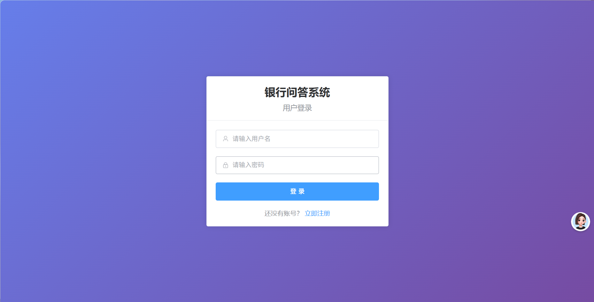
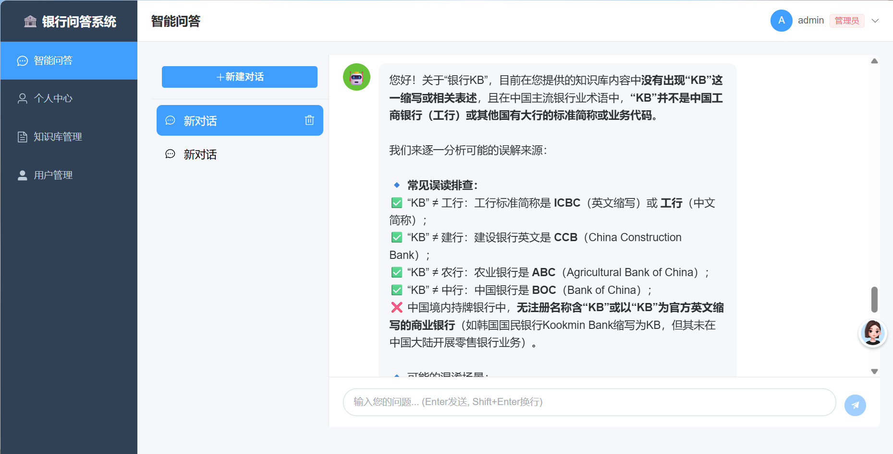
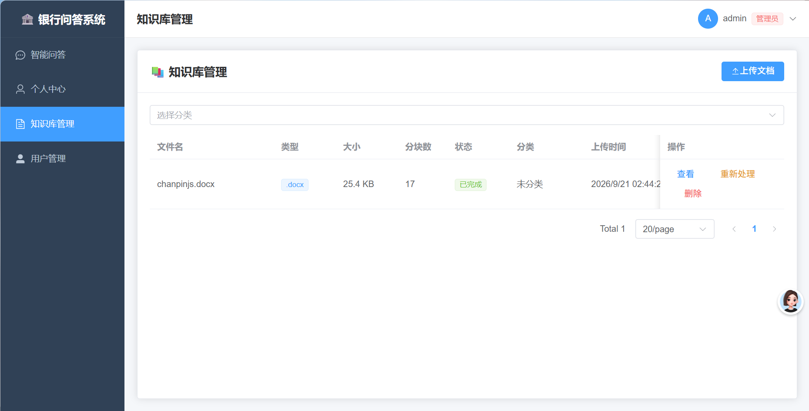

# 🏦 银行知识库智能问答系统

基于 LangChain 框架的企业级银行客服智能问答系统，帮助银行客服人员快速、准确地回答用户关于银行相关问题。

## ✨ 核心特性

- 🤖 **智能问答**：基于 RAG（检索增强生成）技术，结合知识库进行准确回答
- 📚 **知识库管理**：支持文档上传、解析、向量化，管理员可管理知识库
- 💬 **引用来源**：每个回答都标注知识库来源，可追溯验证
- 👥 **多用户支持**：用户注册、登录，独立会话管理
- 🔄 **流式响应**：实时输出回答，提升用户体验
- 🔐 **权限控制**：管理员和普通用户权限分离

## 🛠️ 技术栈

### 后端
- **Python 3.11+**
- **FastAPI** - 高性能异步Web框架
- **LangChain** - AI应用开发框架
- **阿里云百炼（通义千问）** - LLM模型
- **SQLite** - 主数据库（可切换PostgreSQL）
- **ChromaDB** - 向量数据库（本地嵌入式，目录 `backend/chroma_data/`）

### 前端
- **Vue 3** - 响应式前端框架
- **Element Plus** - UI组件库
- **TypeScript** - 类型安全
- **Pinia** - 状态管理

## 🚀 快速开始

### 环境要求

- Python 3.11+
- Node.js 18+
- npm 或 yarn

### 1. 安装后端依赖

```bash
cd backend
pip install -r requirements.txt
```

### 2. 配置环境变量

复制 `.env.example` 为 `.env` 并填写配置：

```bash
cp .env.example .env
```

关键配置项：
- `DASHSCOPE_API_KEY`: 阿里云百炼API Key（必须）

### 3. 启动后端服务

```bash
cd backend
python run.py
```

后端服务将在 http://localhost:8000 启动

### 4. 安装前端依赖

```bash
cd frontend
npm install
```

### 5. 启动前端开发服务器

```bash
cd frontend
npm run dev
```

前端将在 http://localhost:5173 启动

### 6. 访问系统

打开浏览器访问 http://localhost:5173

**默认管理员账号**：
- 用户名：admin
- 密码：123456

## 🐳 Docker 一键部署（推荐服务器部署）

不想手动装 Python/Node？用 Docker 一条命令跑起来（前端 Nginx + 后端 FastAPI 双容器，数据自动持久化）：

```bash
cp backend/.env.example backend/.env    # 填入 DASHSCOPE_API_KEY
cd deploy/docker
docker compose up -d --build            # 一条命令启动
```

访问 `http://服务器IP` 即进入系统。

> 📖 **详细小白教程**（装 Docker、防火墙、备份恢复、常见问题）见 [docs/DEPLOY_DOCKER.md](docs/DEPLOY_DOCKER.md)

## 📖 使用说明

### 管理员功能

1. **登录系统**：使用管理员账号登录
2. **知识库管理**：进入"知识库管理"页面
   - 上传文档（支持PDF、Word、TXT、Markdown）
   - 查看文档处理状态
   - 管理文档分类
3. **用户管理**：进入"用户管理"页面
   - 查看系统统计
   - 管理用户状态

### 普通用户功能

1. **注册/登录**：注册新账号或使用已有账号登录
2. **智能问答**：进入"智能问答"页面
   - 输入问题进行知识库问答
   - 查看回答的引用来源
   - 管理对话历史

## 🏗️ 项目结构

```
LangChain-Agent/
├── backend/                     # 后端代码
│   ├── app/
│   │   ├── api/                 # API路由
│   │   ├── core/                # 核心功能
│   │   ├── models/              # 数据模型
│   │   ├── schemas/             # 请求/响应模型
│   │   ├── services/            # 业务逻辑
│   │   └── main.py              # 应用入口
│   ├── requirements.txt
│   └── run.py
├── frontend/                    # 前端代码
│   ├── src/
│   │   ├── api/                 # API请求
│   │   ├── components/          # 组件
│   │   ├── stores/              # 状态管理
│   │   ├── views/               # 页面
│   │   └── router/              # 路由配置
│   └── package.json
└── docs/                        # 项目文档
```

## 🔧 API文档

启动后端服务后，访问 http://localhost:8000/docs 查看完整的API文档（Swagger UI）。

## 📝 注意事项

1. **API Key安全**：请勿将API Key提交到代码仓库
2. **Embedding 调用**：文档向量化使用阿里云百炼 Embedding API，需保证 `DASHSCOPE_API_KEY` 有效且有调用额度
3. **文件大小**：文档上传限制为10MB
4. **浏览器兼容**：推荐使用Chrome、Edge等现代浏览器

## 🤝 贡献

欢迎提交Issue和Pull Request！

## 🔄 版本管理（Git/GitHub）

本项目通过 Git 同步到 GitHub：`https://github.com/wei1264610123/bank-knowledge-base-agent`

### 克隆到新电脑

```bash
git clone https://github.com/wei1264610123/bank-knowledge-base-agent.git
cd bank-knowledge-base-agent
```

### 修改代码后同步更新（记住这 3 行）

```bash
git add .
git commit -m "这次改了什么（简要说明）"
git push
```

每次改完代码执行这三行，GitHub 上的仓库就会同步更新。

### 常用查看命令

```bash
git status        # 查看哪些文件被修改了
git log --oneline # 查看提交历史
git pull          # 从 GitHub 拉取最新代码（换电脑/多人协作时用）
```

### 不会上传的内容（已在 `.gitignore` 中排除，请勿删除该配置）

- `backend/.env`：API Key 等敏感配置（提交前请确认未包含）
- `backend/bankkb.db`、`backend/chroma_data/`、`backend/uploads/`：本地数据库、向量库与上传文件
- `backend/reports/`、`frontend/node_modules/`：测试报告与依赖

新环境按 `backend/.env.example` 复制为 `.env` 并填写 `DASHSCOPE_API_KEY` 即可运行。

### 成品页面




## 📄 许可证

MIT License
